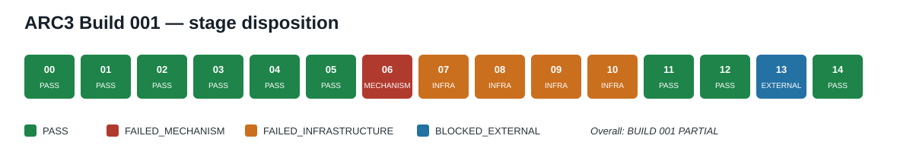

# ARC3 Build 001 — Local-public failure recovery

- **Overall status:** `BUILD 001: PARTIAL`
- **Branch:** `build/001-local-public-recovery`
- **Draft pull request:** <https://github.com/Grativy6/ARC3/pull/5>
- **Measured labels:** `synthetic`, `local-public`
- **Unmeasured labels:** `online-public`, `Kaggle-public`, `semi-private`, `official-private`
- **Claim boundary:** `NO_GENERALIZATION_CLAIM`

## Abstract

Build 001 attempted to repair the Build 000 controller's low public-game action throughput and
known palette/action equivariance failures without game-specific tuning. It reproduced the frozen
`local-public` failure, instrumented the exact hot path, and isolated two material runtime causes:
allocation tracing and checkpoint persistence. It then added generic palette-role correspondence
and opaque-action calibration mechanisms that passed large paired `synthetic` suites. A
predeclared rule-change/reopening matrix completed 112/112 executions but failed its typed
acceptance gates. Later decisive development and regression matrices ended at authenticated
infrastructure boundaries, so local-public recovery and the Build 001 ablation comparison remain
unmeasured.

The ten-game public holdout therefore did not earn its five-part gate and remains permanently
sealed and unconsumed in Build 001. The final available-surface package is deterministic,
offline, secret-free, and independently exercised on Windows and hosted Ubuntu/Windows. Exact
private Kaggle wheels, framework input, gateway, and scorer were unavailable, so package status is
`BLOCKED_EXTERNAL`, not PASS. Overall status is `PARTIAL`: there are real bounded mechanism
successes and one real failed mechanism, but the recovery objective was not validly measured.

## 1. Source and machine identity

Build 001 began from canonical `main`
`28c7a00732ce48e5c231211b01bc6eba7d0d71b4`, tree
`4586299448e9b1b585a0878674ed5f9afa60c384`. Build 000's merge and evidence seal remain immutable
historical provenance. The decisive production policy is
`d6d4bac1e33c9837856c08abcee61bcb14afd34e`, tree
`dd8e82e4b34337a208110929e3f5f8079d1e0a18`, source hash
`sha256:8f0de1a9c2c88761951ba2bcd69f2612bedfa0cc4226f44f1ed272b54b9023a8`.

The measured host was Windows 10 Home 10.0.19045 on an AMD Ryzen 5 2600 with 6 physical/12
logical cores, 17,124,503,552 visible RAM bytes, and an NVIDIA GTX 1660 with 6,144 MiB; CPU was
selected. The project runtime was CPython 3.12.14, uv 0.12.5, and Git 2.54.0.windows.1. All five
pinned upstream repository heads, `arc-agi==0.9.9`, `arcengine==0.9.3`, and eight static
documentation identities remained unchanged. Two dynamic organizer pages drifted; their old/new
hashes are preserved in the Stage 00 report and were not silently adopted.

The owner explicitly authorized MIT-0. The operative root `LICENSE` is
`sha256:7f433e520d07d56ad14d92e9da9f580771479c30a2bfccc8024eed308f21bbe8`.
`THIRD_PARTY_NOTICES.md` remains operative at
`sha256:dd3b46094c40b5bf2a0b13892382e05ebaa1e8006f341f94f1279a87ffdbf70a`.

## 2. Build 000 inherited evidence

Build 000 remains a frozen comparator, not a source of new Build 001 measurements. Its strongest
integrated `synthetic` result was FULL 32/32 in 190 actions versus deterministic cycle 4/32 in 463
under equal 16-action budgets. Its broader frozen ablation matrix reported:

| Historical Build 000 variant | Completed | Actions | Bounded finding |
|---|---:|---:|---|
| FULL | 8/14 | 150 | frozen reference |
| no world-model simulation | 1/14 | 211 | seven lost completions |
| no goal inference | 0/14 | 224 | eight lost completions |
| no retrodiction gate | 8/14 | 141 | same completion, nine fewer actions; conflict retained |

Build 000's public evidence was negative: FULL timed out in all 30 Stage 15 runs and all six Stage
18 smoke runs, with zero completed levels. B0 random produced the sole nonzero Stage 15 score and
one development-level completion. Official RHAE was null/unmeasured. Build 001 does not rewrite
those facts.

## 3. Reproduction diagnosis

Stage 01 exactly reproduced the development failure on the frozen development case at seed 7,
80-action/8-reset/120-second limits:

| Policy | Wall seconds | Actions | Levels | Local score | Terminal |
|---|---:|---:|---:|---:|---|
| Build 001 FULL | 120.11965939996298 | 21 | 0 | 0.0 | timeout |
| frozen Build 000 FULL | 120.110601900029 | 19 | 0 | 0.0 | timeout |

This is `local-public` `REPRODUCED_FAILURE`, not recovery. The score is local and unverified by an
official evaluator; official RHAE remains null.

## 4. Throughput causal map

Stage 02 attributed 99.9783265303% of one eight-action local-public prefix. Action selection used
48.06% of measured wall, checkpoint work 16.97%, startup 10.84%, goal work 9.22%, trace work
6.12%, retrodiction 2.35%, and planning 1.10%. Instrumentation added a measured 4.62% median
overhead on the paired synthetic calibration.

Stage 03 then used matched actions and returned consequences to isolate causal timing effects:

| Intervention | Wall seconds | Change from 46.070333300042-second control |
|---|---:|---:|
| allocation tracing off | 8.84490280004684 | -37.2254304999951 s (-80.80%) |
| checkpoints off | 37.9903721000301 | -8.07996120001189 s (-17.54%) |
| both off | 6.75240610004403 | -39.31792719999797 s |

This supports `THROUGHPUT_BOTTLENECK_IDENTIFIED`. These diagnostic switches are not a production
repair receipt and do not establish better public performance.

## 5. Palette equivariance

Stage 04's generic palette-role mechanism passed all predeclared controlled checks:

- 2/2 frozen historical palette regressions;
- 256/256 procedural paired bijections;
- 16/16 checkpoint/resume pairs;
- 64/64 joint-color equivalence controls;
- 64/64 one-sided distinguishability controls;
- 0 controller faults across 324 measured episodes and 48,598 trace events.

This is `synthetic` `PALETTE_EQUIVARIANCE_OBSERVED`. It does not prove arbitrary color invariance.
The historical unpermuted comparison grew from eight to ten actions (+25%), so efficiency remains
an open burden.

## 6. Action equivariance

Stage 05's opaque-handle calibration passed:

- 2/2 frozen historical action-remap regressions;
- 128/128 procedural pairs;
- 528/528 post-calibration inverse action requests;
- 64/64 causal controls;
- 16/16 checkpoint/resume pairs;
- 0 controller faults across 292 measured executions and 55,707 trace events.

This is `synthetic` `ACTION_EQUIVARIANCE_OBSERVED`. It does not establish arbitrary unseen-action
semantics. The historical unpermuted comparison grew from eight to twelve actions (+50%), while
the two remapped wins used nine and five actions; calibration cost remains explicit.

## 7. Rule-change reopening

Stage 06 ran all 112 predeclared `synthetic` controller executions, 2,084 environment actions, and
53,980 trace events in 849.782134 seconds at 120,565,760-byte peak RSS. All 112 traces replayed and
preserved immutable prefixes. The result is nevertheless `FAILED_MECHANISM`:

| Family | Typed acceptance | Terminal wins | Result |
|---|---:|---:|---|
| action-effect rotation | 32/32 | 32/32 | PASS |
| traversability flip | 0/32 | 32/32 | FAILED_MECHANISM |
| stationary noise | 0/32 | 32/32 | FAILED_MECHANISM |
| checkpoint/resume | 4/8 pairs | n/a | FAILED_MECHANISM |

Successful terminal outcomes do not retroactively satisfy the typed evidence gate. The full-stage
claim `RULE_CHANGE_REOPENING_OBSERVED` is therefore not made.

## 8. Retrodiction decision

Stage 07's sole 280-cell attempt created 279 cell directories but no aggregate result and no
microbenchmark. It is `FAILED_INFRASTRUCTURE`. Exact recoverable receipts showed FULL,
EVENT_TRIGGERED, and CACHED modes promoted true rules 8/8 and rejected false rules 8/8;
RECENT_WINDOW_8 promoted both true and false rules 8/8, while NONE was intentionally ungated. Nine
local-public prefixes each preserved 65 actions and 65 consequences, zero levels, and the same
epoch-bound fault.

The production default remains FULL because no eligible replacement decision was measured. These
partial receipts diagnose behavior but do not form a winner, ablation, or public recovery result.

## 9. Two-speed controller architecture

The Build 001 controller separates a bounded fast path—frame correspondence, incremental effect
updates, cached progress and known-plan continuation—from a deliberative path triggered by
startup uncertainty, contradiction, novelty, repeated no-progress, or rule-change reopening.
Caches bind immutable evidence/configuration identities and invalidate on typed reopening. An
explicit safe fallback, not wall timeout, chooses any fallback action.

Stage 08's sole 20-cell attempt ended `FAILED_INFRASTRUCTURE` after one cell and eight actions.
There were zero valid timing pairs, so neither throughput reduction nor public recovery was
measured. Two evidence-validator false negatives were repaired and tested for future runs, but the
unique attempt remains immutable and was not rerun.

## 10. Development evaluation

Stage 09 froze 96 matched development cells across 12 identities, two seeds, four policy variants,
80-action/8-reset budgets, 120-second worker limits, and a 14,400-second active overall budget.
All 14 non-playing preflight predicates passed. The single authorized execution then ended
`FAILED_INFRASTRUCTURE` at its first exposure: the Windows launcher PID was 21056 while the actual
interpreter PID was 23936, so two exact worker-identity predicates failed closed.

The environment was never opened, zero gameplay actions occurred, and 95 cells remained
unstarted. All 16 surviving evidence files remained byte-identical through reconstruction. The
generic launcher repair is verified for future runs, but Stage 09 cannot be resumed or rerun.
`LOCAL_PUBLIC_RECOVERY_OBSERVED` is not claimed.

## 11. Regression suite

Stage 10 also consumed its single attempt and ended `FAILED_INFRASTRUCTURE`. The first of nine
suites invoked the competition-integrity scanner without its mandatory frozen-commit argument;
the child returned 2, and eight suites remained unstarted. The nine-file terminal graph is
authenticated. Future plan and failed-terminal reconstruction were repaired without rerunning the
experiment.

Build 001 therefore has no Stage 10 baseline, ablation, robustness, or resource comparison.
Historical Build 000 values remain historical comparators only; they are not substituted as Build
001 measurements.

## 12. Holdout gate and nonconsumption

Stage 11 mechanically evaluated the five frozen predicates. All five were false, including the
required Stage 09 and Stage 10 PASS predicates. It wrote `HOLDOUT_NOT_EARNED` with zero identities
loaded and no manifest parse. Stage 12 then wrote a hash-bound nonconsumption receipt with:

- no environment adapter load;
- zero environment actions;
- no gameplay open;
- zero holdout identities loaded;
- no manifest parse.

The ten-game public holdout is `SEALED_UNCONSUMED` for Build 001. No holdout score or public-holdout
result exists, and the gate cannot be weakened or reopened within this build.

## 13. Package and reproducibility

The clean local `d9c19558…` verifier built two byte-identical 788,071-byte archives at
`sha256:0bd55b93d1652f1d2f09aafb74189d5b6050e4a9fae3df9aa9925359f2a095bd`.
It passed 699 package-safe tests with two platform skips, lint, formatting, strict typing, offline
lock resolution, runtime doctor, startup, integrity, source identity, license, and secret checks.
Startup took 1.6057818999979645 seconds at 67,846,144-byte peak RSS and recorded zero network and
process-launch attempts. The sealed evidence set contains 46 files, 4,182,060 bytes, and zero
secret findings.

The final `9f25e13…` package freeze changed only CI/test boundary files and preserved the 100-member
runtime payload projection. Because the archive embeds exact source identity, its final 788,070-byte
candidate hash is
`sha256:02326a145d510c017dc04ffd79a61cfe8c46771cbc9e74b7c8f29a9b75756d21`.
Four exact-source hosted Ubuntu/Windows jobs reproduced its A/B bytes and reached the same
authenticated external boundary. The code/test freeze is independently verified in a clean clone.
Exact private Kaggle wheels, platform Agents input, gateway, and scorer
were not available. Package status is therefore `BLOCKED_EXTERNAL`; it is not `Kaggle-public`,
`semi-private`, or `official-private` evidence. No upload or submission occurred.

The first long-root verification attempt remains `FAILED_MECHANISM` after three Windows
path-length test failures. The accepted retry changed only external root lengths. Both receipts
are preserved in `docs/evidence/001-13-offline-package.json`.

## 14. Stage disposition

| Stage | Status | Evidence label | Exact disposition |
|---:|---|---|---|
| 00 | PASS | synthetic | source/license/base verified |
| 01 | PASS | local-public | frozen failure reproduced |
| 02 | PASS | synthetic, local-public | hot-path attribution added |
| 03 | PASS | synthetic, local-public | causal bottlenecks identified |
| 04 | PASS | synthetic | palette mechanism observed |
| 05 | PASS | synthetic | action mechanism observed |
| 06 | FAILED_MECHANISM | synthetic | typed reopening gates failed |
| 07 | FAILED_INFRASTRUCTURE | synthetic, local-public | unique retrodiction matrix incomplete |
| 08 | FAILED_INFRASTRUCTURE | synthetic, local-public | unique two-speed matrix incomplete |
| 09 | FAILED_INFRASTRUCTURE | local-public | development recovery not measured |
| 10 | FAILED_INFRASTRUCTURE | synthetic | regression/ablation result unavailable |
| 11 | PASS | synthetic | `HOLDOUT_NOT_EARNED` procedure |
| 12 | PASS | synthetic | sealed nonconsumption |
| 13 | BLOCKED_EXTERNAL | synthetic | deterministic package; private surface absent |
| 14 | PASS | synthetic | report, evidence index, verification, draft PR |

## 15. Failures and open burdens

Material unresolved burdens are preserved, not erased by later successes:

- no valid Build 001 local-public recovery result, public-holdout result, RHAE, or hidden/private
  generalization result exists;
- allocation-tracing/checkpoint diagnostic speedups have not been established as a production
  public recovery;
- palette and action repairs carry measured calibration/efficiency costs;
- traversability/noise typed reopening and 4/8 checkpoint continuity failed at Stage 06;
- the Stage 07/08/09/10 unique matrices remain incomplete and non-rerunnable;
- historical candidate rank lacks a prefix-derived authority fold, and an in-process non-return can
  outlive a post-hoc wall gate;
- exact private platform surfaces and full 110-game sequential runtime are unmeasured;
- Python audit hooks and static scans are not complete OS/native containment or trusted execution;
- dynamic organizer pages may drift independently of pinned executable/static identities.

Build 001 does not prove hidden-game generalization, AGI, consciousness, PAL, or a general theory
of intelligence. Christopher D. Pang is author and steward; AI systems were engineering tools and
assistants, not co-authors, owners, or independent authorities.

## Smallest owner-only next action

Review draft pull request #5. It remains draft and unmerged.
